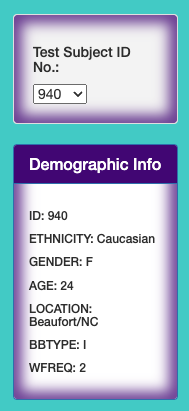
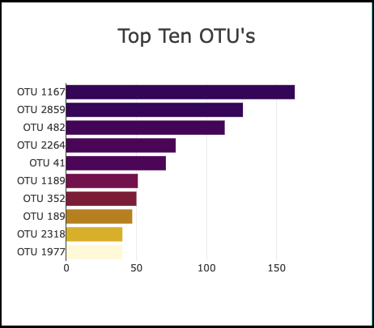
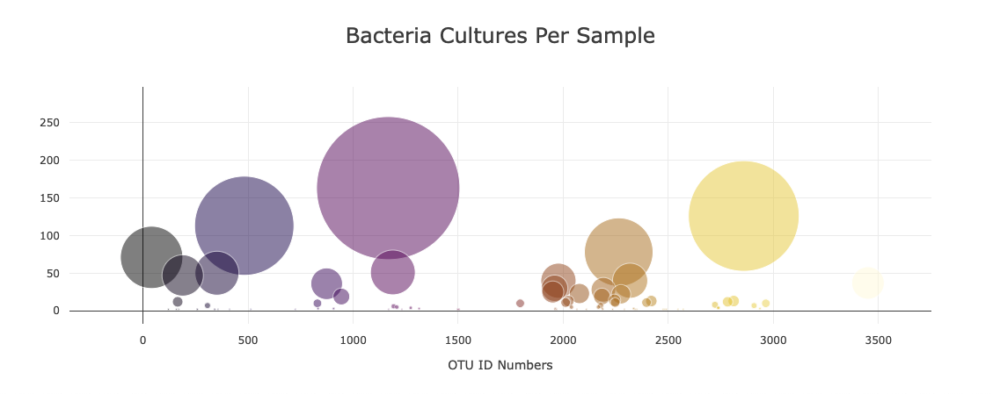
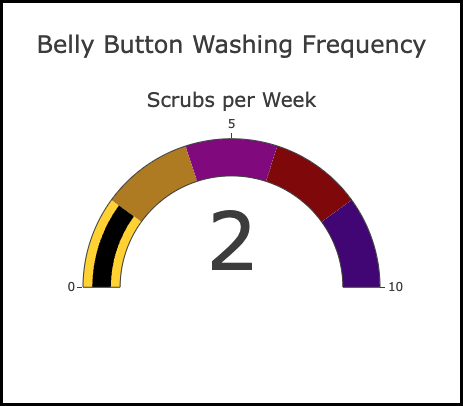
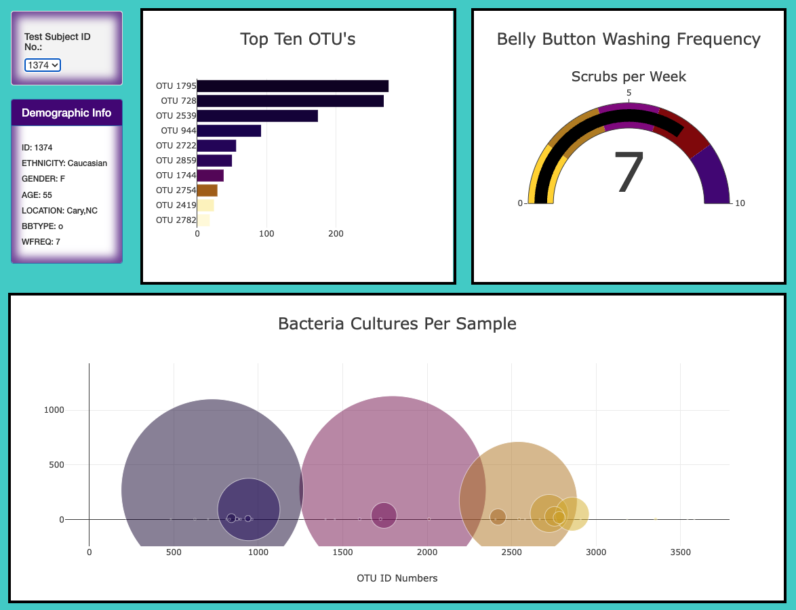

# belly_button

## Overview
In this project I bult a website that provides a dashboard for a biodiversity research project for a fictitious company named Improbable Beef. The dashboard provides the ability to anonymously look up participants samples of belly button biodiversity data that has been collected. 

## Webpage: https://kimberlyw618.github.io/belly_button/

### Resources

- Software:
    - Visual Studio Code (Version: 1.76.2)
    - Google Chrome 
- Languages: JavaScript, css, HTML
- Data Source: [samples.json](samples.json)
- Starter Code: [starter_code/starter_charts.js](starter_code/starter_charts.js)

### Generated Code 
- JavaScript Code [charts.js](charts.js)
- Css Code [style.css](style.css)
- HTML Code [index.html](index.html)

### Webpage Images 
#### Test Subject ID No. selector and Demographic Info Panel

#### Bar Graph

#### Bubble Chart

#### Gauge Scale

#### Results from Test Subject #1374

### References 
Color scales: https://plotly.com/javascript/colorscales/
Colors: https://matplotlib.org/3.1.0/gallery/color/named_colors.html
Bubble plot: https://plotly.com/javascript/bubble-charts/#marker-size-and-color-on-bubble-charts 
html/css cheat sheet: https://htmlcheatsheet.com/css/ 
